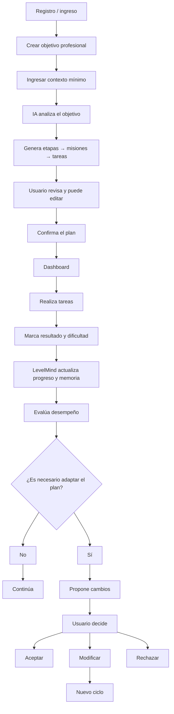

# LevelMind — MVP

## 1. Problema

Muchas personas tienen objetivos profesionales claros, pero encuentran dificultades para mantener la constancia, transformar objetivos amplios en acciones concretas o visualizar el progreso acumulado a partir de pequeñas tareas.
LevelMind busca convertir objetivos profesionales en un camino estructurado y adaptable, permitiendo que el usuario entienda cómo cada acción concreta contribuye al objetivo general.

## 2. Público objetivo

Personas que buscan avanzar en objetivos de desarrollo profesional y necesitan apoyo para:

- organizar objetivos amplios;
- dividirlos en acciones concretas;
- mantener constancia;
- visualizar progreso;
- adaptar el plan según su desempeño real.

En esta primera versión, LevelMind estará enfocado exclusivamente en objetivos profesionales y de aprendizaje.

## 3. Propuesta de valor

LevelMind transforma un objetivo profesional en un plan progresivo estructurado en:

> Objetivo → Etapas → Misiones → Tareas

A partir de información breve sobre el usuario, el sistema genera un camino inicial y registra su progreso.
El feedback proporcionado durante la ejecución permite que LevelMind evalúe si el plan sigue siendo adecuado y proponga modificaciones cuando sea necesario.
Las modificaciones importantes nunca se aplican automáticamente: el usuario mantiene el control y debe aprobar, modificar o rechazar los cambios propuestos.

## 4. Información inicial del usuario

Para evitar un onboarding extenso, LevelMind solicitará únicamente:

- objetivo profesional;
- situación actual;
- resultado esperado;
- plazo aproximado;
- disponibilidad aproximada.

## 5. Alcance funcional del MVP

El MVP incluirá:

- creación de objetivos profesionales;
- generación de un plan mediante IA;
- organización en etapas, misiones y tareas;
- estimación de duración de etapas y misiones;
- visualización del progreso general;
- edición manual de tareas generadas;
- marcado de tareas como completadas o no completadas;
- feedback de dificultad: Fácil / Normal / Difícil;
- persistencia de objetivo, plan, progreso y feedback;
- evaluación del desempeño del usuario;
- propuestas de adaptación del plan;
- aprobación humana antes de aplicar modificaciones importantes;
- sistema básico de XP;
- niveles;
- porcentaje de progreso.

## 6. Gestión del tiempo

LevelMind no utilizará un calendario rígido en el MVP.
El sistema podrá estimar la duración de etapas y misiones según el plazo y la disponibilidad del usuario, pero la organización diaria quedará bajo control del usuario.
El objetivo es acompañar el progreso sin generar una sensación de penalización constante ante retrasos.

## 7. Usuarios

La arquitectura estará preparada para soportar múltiples usuarios.
El objetivo del MVP es implementar registro e inicio de sesión real.
Si la autenticación introduce una complejidad que pone en riesgo la entrega, se utilizará temporalmente un perfil persistente de demostración sin modificar el resto de la arquitectura.

## 8. Human-in-the-Loop

LevelMind podrá detectar patrones en el progreso del usuario y proponer cambios.

Ejemplo:

- agregar tareas de refuerzo;
- reemplazar una tarea;
- modificar dificultad;
- reordenar contenido;
- extender una etapa.

Antes de aplicar una modificación, el usuario podrá:

- aceptar;
- modificar;
- rechazar.

## 9. Memoria y adaptación

El sistema conservará información como:

- objetivo original;
- plan generado;
- tareas completadas;
- tareas no completadas;
- dificultad reportada;
- modificaciones manuales;
- adaptaciones aceptadas;
- adaptaciones rechazadas.

El feedback no será tratado solamente como una valoración de una tarea, sino como nueva información sobre el usuario.

Por ejemplo, si una persona declara tener experiencia intermedia en una tecnología pero encuentra repetidamente difíciles tareas básicas, LevelMind podrá detectar que la estimación inicial posiblemente fue incorrecta y recomendar una etapa de refuerzo.

## 10. Gamificación

El MVP tendrá únicamente:

- XP;
- nivel;
- porcentaje de progreso.

Elementos más complejos de gamificación quedan fuera del alcance inicial.

## 11. Fuera de alcance

No forman parte del MVP:

- objetivos personales genéricos;
- aplicación móvil;
- calendario obligatorio;
- notificaciones push;
- avatares;
- inventario;
- marketplace;
- rankings;
- sistema social;
- amigos;
- badges complejos;
- integraciones con calendarios externos;
- recomendaciones entre usuarios;
- chatbot de propósito general.

Estas funcionalidades podrán evaluarse en versiones futuras.

## 12. Flujo principal

